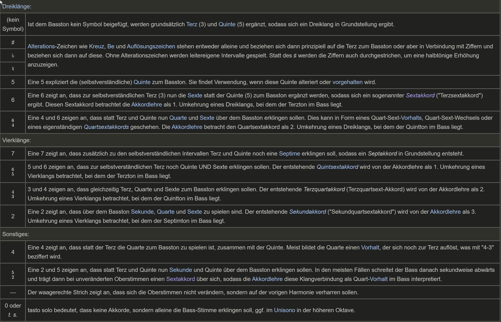

# Zusammenfassung des Klausurenstoffs für die erste Musikklausur

## Stoffumfang

* Klangkörper im Wandel 1: Barock
	* Konzertieren
	* Basso Continuo
* Klangkörper im Wandel 2: Wiener Klassik

### Barock

Von ca. 1600 (Schaffenszeit Monteverdi) bis 1750 (Tod von Johann Sebastian Bach)

Wichtige Künstler der Zeit:
* Johann Sebastian Bach
* Georg Friedrich Händel
* Claudio Monteverdi
* Jean-Baptiste Lully

Wird auch als Generalbasszeitalter betitelt

#### Konzertieren

* Abwechslung/"Wetteifern" zwischen `Concertino (Solo)` und `Ripieno (Tutti)` Gruppe
* Concertino Instrumente `Wetteifern` durch zb. Imitation; Vorhaltsketten
* Unterscheidung `Solokonzert` / `Concerto Grosso`
* Formale Gestaltung: Ritornellform 

```default
Ritornell -> Episode -> Ritornell -> Episode [...] -> Ritornell
Dabei gillt:
Ritornell wird vom Tutti (ripieno) gespielt
Episoden werden vom Soli(concertino) gespielt
```
* Ritornell
	* Oft verkürzt 
	* auf wechselnden Tonstufen
* Episoden
	* Modulieren (Tonika/Tonartenwechsel)
		* meistens unterschwellig


#### Generalbass (**Basso Continuo**)

* Begleitstimme aus
	* Bassinstrumenten
		* Kontrabass
		* Cello
		* Fagott
		* linke Hand des Cembalo
		* etc.
	* Akkordinstrumenten
		* Cembalo
		* Orgel
		* Laute
		* etc.

* Halb Improvisiert: es werden nur Akkordtypen festgelegt \



## Wiener Klassik

Von ca. 1779 bis 1825

Wichtige Künstler:
* Ludwig van Beethoven
* Joseph Haydn
* Wolfgang Amadeus Mozart

Standartisierung und Vergrößerung der Orchesterbesetzung
* Streicher _(Violine 1 + 2, Viola, Cello, Kontrabass)_
* Bläser _Je 2 Fach besetzt (Horn, Klarinette, Trompete, Oboe, Fagott, Querflöte)_
* Pauken _2 Töne, in der Regel Grund- und Quintton_
Feste Sitzordnung, nur noch unterschiede nach Dirigent oder Region

Dirigent wird Notwendig

`Durchbrochene Arbeit`: Aufteilung einer Melodie auf mehrere Insturmente \
	-> Neue Möglichkeiten von Klangkombinationen \
	-> Spiel mit Breite/Stereowirkung
