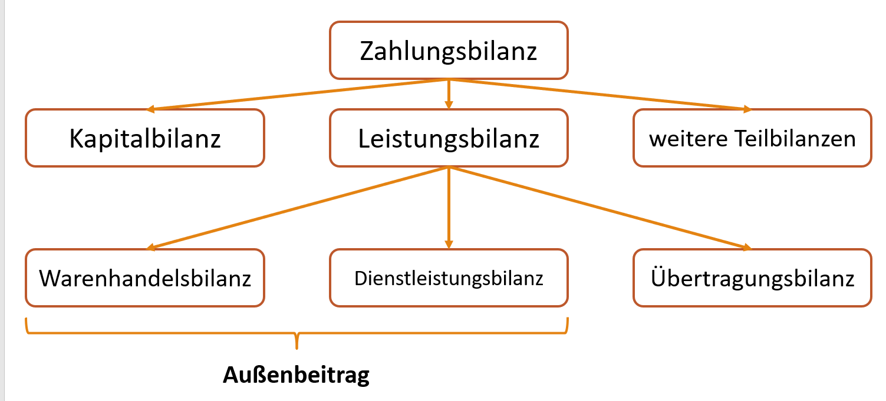

# Zusammenfassung des Stoffs für die erste Wirtschaftsklausur

## Stoffumfang

* 1.1 Volkswirtschaftliche Zielsetzungen
	* 1.1 Soziale Marktwirtschaft und Stabilitätsgesetz
	* 1.2 Ziele des Magischen Vierecks
		* 1.3 Erweiterung des Magischen Vierecks
		* 1.4 Wirtschaftswachstum
		* 1.5 Hoher Beschäftigungsstand
		* 1.5 Preisniveaustabilität
		* 1.7 Außenwirtschaftliches Gleichgewicht
		* 1.8 Zielbeziehungen
* 1.2 Bestimmungsgrößen betreibswirtschaftlicher Entscheidungen
	* 2.1 Ziele eines Unternehmens
	* 2.2 Kosten, Erträge und Gewinne

### 1.1 Volkswirtschaftliche Zielsetzungen

#### Soziale Marktwirtschaft

VWL ist die Lehre von wirtschaftlichen Zusammenhängen und beschäftigt sich mit Transaktionen `(wirtschaftlich relevante Handlungen)`, die von Wirtschaftssubjekten`(Person oder Firma die Handelt)` bezüglich Wirtschaftsobjekten `(Gegenstand von Transaktionen, Güter oder Geld)` durchgeführt werden.

Man kann die Wirtschaft einzeln (einzelwirtschaftliche Betrachtung) oder als gesamtes (Gesamtwirtschaftliche Betrachtung) betrachten.

##### Aufgaben der VWL

* Beschreibung/Erklärung wirtschaftlicher Zusammenhänge
* Prognose Wirtschaftlicher Entwichklungen
* Beratung der Politik

##### Methoden der VWL

* Modellbildung
* Lage-Ziel-Mittel-Analyse `Wie ist es? - Wie soll es sein? - Was muss getan werden, dass es so wird`
* Ceteris paribus Klausel `Man verändert nur einen Faktor, und beobachtet die Auswürkung => die anderen Faktoren bleiben gleich`

#### Das Stabilitätsgesetz

Bestimmt gesamtwirtschaftliche Ziele, die Haushalte in Deutschland bei ihren Entscheidungen beachten sollen.

Trat am 8. Juni 1967

Diese Ziele sind bekannt als das `Magische Viereck`

#### Das Magische Viereck

Zeigt vier Ziele für die BRD, die alle gleichmäßich beachtet werden sollen.

* Hoher Beschäftigungsstand
	* Vollbeschäftigung
* Außenwirtschaftliches Gleichgewicht
	* Importe und Exporte in Waage
* Stabieles Preisniveau
	* Geringe Inflation (ca. 2%)
* Wirtschaftswachstum
	* angemessen und stetig


##### Hoher Beschäftigungsstand
Zur Messung des Beschäftigungsstandes wird die Arbeitslosenquote erhoben, aber auch die Anzahl der erwerbstätigen Personen.

`Arbeitslosigkeit: Die Zahl an Menschen die zu vorherschendem Lohnsatz auf dem Arbeitsmarkt zur Verfügung stehen und keine Arbeit haben.`

-> Keine Kranken/Alten
-> Keine Menschen denen der Mindestlohn zu wenig ist / Menschen die genig Geld haben

```
					Registrierte Arbeitslose
Arbeitslosenquote = ------------------------- * 100
					Zivile Erwerbspersonen 
```
Ist die Arbeitslosenquote unter 3% wird von Vollbescheftigung gesprochen. In Deutschland lag die Arbeitslosenquote 2019 bei 4,8%
Nicht bedacht werden:

`Verdeckte Arbeitslosigkeit`: Menschen in schlecht bezahlten Jobs/in Kurzarbeit/auf Fortbildung/Umschulungen sind, und nicht Arbeitslos gemeldet sind.
`Stille Reserve`: Menschen die sich aktiv nicht arbeitslos melden, weil sie zb. keinen Anspruch auf Arbeitslosengeld haben, oder aus Scham.

###### Arten der Arbeitslosigkeit

`Saisonelle Arbeitslosigkeit`: Saisonarbeiter wie Erntehelfer, die nach Erntesaison keine Arbeit mehr haben
`Friktionelle Arbeitslosigkeit`: Übergangszeit zwischen Anstellungen
`Konjunkturelle Arbeitslosigkeit`: Anstellungen werden durch Rezzession beendet
`Strukturelle Arbeitslosigkeit`: Technisch: Maschine ersetzt Mensch | Sektoral: Sektorspezifischer Arbeitsplatzmangel | Regional: Wirtschaftliche Schwachgebiete

##### Außenwirtschaftliches Gleichgewicht
Um das Außenwirtschaftliche Gleichgewicht zu Messen, wird der Außenbeitrag einer Volkswirtschft angesehen. Er gibt die Differenz zwischen importierten und exportierten Waren und Devisen an.
-> Devisen sind ausländische Zahlungsmittel

Deutschland als Exportweltmeister hat einen dutlich Positiven Außenbeitrag.

Die Verschiedenen zu und abflüsse von Waren und Devisen können in Bilanzen zusammengefast werden:

© Armin Prinz

###### Begründung des Ziels

Ein Land das mehr Importiert als Exportiert ist irgendwann Zahlungsunfähig
Ein Land das mehr Exportiert als Importiert ist auf den Wert der Währung und die Kaufkraft anderer angewiesen

Durch Handel mit anderen Ländern werden die Vorteile der internationalen Arbeitsteilung wargenommen

##### Stabieles Preisnieveau

Der Anstieg des Preisniveaus wird `Inflation` genannt. Die Inflationsrate kann über die Veränderung des  Verbraucerpreisindex gemessen werden.


Man berechnet den VPI indem man den Preis eines Wahrenkorbs mit Artikeln eines "durchschnittlichen" Bürgers über die Jahre hinweg betrachtet
```
		Preis des Wahrenkorbs im Berichtsjahr
VPI = 	-------------------------------------  * 100
		Preis des Wahrenkorbs im Basisjahr
```

```

Inflationsrate(Jahr T) = {[VPI(Jahr T) - VPI(Jahr T - 1)] / VPI(Jahr T - 1)}

```

Die Europäische Zentralbank hat sich als zentales Ziel vorgenommen, die Inflation bei 2% zu halten

###### Arten von Inflation

* Offene Inflation: von jedem Erkennbar
* Verdeckte Inflation: Inflation ist nicht sofort erkennbar
* Zurückgestaute Inflation: Inflation ist nicht für jeden erkennbar
-> Preisniveau wird durch staatliche Maßnahmen konstant gehalten
-> Entstehung von Schwarzmärkten

###### Geschwindigkeiten

* Schleichende Inflation: unter 2%
* Trabende Inflation: Inflationsrate zwischen 2% und 10%
* Gallopierende Inflation: Inflationsrate bis 50%
* Hyperinflation: Inflationsrate bei über 50%

###### Ursachen von Inflation

* Nachfrageinflation: Bei zu viel Nachfrage werden die Bestände knapp und der Preis steigt
* Angebotsinflation: Bei steigen der Produktionskosten steigt der Preis bei gleicher Nachfrage
* Importierte Inflation: Bei Importierten Gütern, wenn der Preis im Ausland steigt.


##### Wirtschaftswachstum

Das Wirtschftswachstum wird anhand des BIP `(Bruttoinlandsprodukt)` gemessen.

Das BIP gibt den Wert aller Waren und Dienstleistungen zu laufenden oder konstanten Preisen an, die innerhalbe eines Zeitabschnittes in einem Land hergestellt werden.

Das Satbilitätsgesetz fordert zwar ein stetiges, aber kein unangemessen hohes Wachstum.
Steigt das BIP zu stark, kann die Nachfrage von Produktionsengpässen nicht befriedigt werden und der Preis steigt.
Ist das Wachstum sehr niedrig kommt es zu Arbeitslosigkeit.

###### Reales / Nominales BIP

Das Nominale BIP betrachtet die Veränderung zum Vorjahr. Man kann also nicht aussagen, ob eine Erhöhung des BIP nicht auf Inflation zurückzuführen ist.

Das Reale BIP betrachtet die Veränderung zu einem Basisjahr

```

Nominales BIP = [Preis Ware 1 * Menge Ware 1 + Preis Ware 2 * Menge Ware 2]

Reales BIP = [Preis Ware 1 im BASISJAHR * Menge Ware 1 + Preis Ware 2 im BASISJAHR * Menge Ware 2]

```

#### Erweitwerung des Magischen Vierecks

Das magische Viereck kann mit vielen anderen Faktoren erweitert werden.
Zum Beispiel haben wir `Gerechtes Einkommen & Vermögensverteilung` und `Umwelt und Recourcenschutz` aufgenommen.

#### Zielbeziehungen

Die Ziele einer VW stehen in bestimmten Verhältinissen zueinander.

Diese sind
* Komplementär: Ziele sind verbunden, d.h. wird ein Ziel angestrebt, wird gleichzeitig ein anderes gefördert
* Kongruierend: Ziele stehen sich gegenüber, d.h. wird ein Ziel angestrebt, wird gleichzeitig ein anderes gebremst
* Indifferent: Ziele haben keine Verbindung zueinander

**FAZIT**: Je nach Ausgangslage müssen unterschiedliche Prioritäten bei der Zielverfolgung gesetzt werden.

### 1.2 Bestimmungsgrößen betreibswirtschaftlicher Entscheidungen

#### Ziele eines Unternehmens

Das Hauptziel eines Unternehmens ist immer Geld zu verdienen!

Rahmenbedingungen für Ziele eines Unternehmens können in Endogen und Exogen aufgeteilt werden.

Exogen sind Rahmenbedingungen wie:
* Das Politische System (Demokratie)
* Die Wirtschaftsordnung (Sozieale Marktwirtschaft)
* Konkurenzsituation (Mitbewerber)
Endogen sind Rahmenbedingungen wie:
* Der Produktionsfaktor Arbeit (Manager, Arbeiter)
* Der Produktionsfaktor Standort (Anbindung)
* Der Produktionsfaktor Kapital (Maschienenausstattung)

Unter Zielsystem versteht man die Zusammenfassung vieler Einzelziele

Man kann die Wirtschaftlichen Ziele in Soziale Ziele und Ökologische Ziele einteilen

Soziale Ziele sind zum Beispiel:
* gewährung freiwilliger soz. Leistungen (zb. Betriebsrente)
* gutes Betriebsklima
* Mitbestimmung durch Arbeitnehmervertretung
* preisgünstige Werkswohnungen

Ökoligische Ziele sind zum Beispiel:
* Einsatz von Ökologisch unbedenklichen Stoffen
* Ressourcenschonung
* Emmissionsarme Verfahren
* Recyclinfähige Verpackungen

##### Unternehmensziel Rentabilität

```
Gewinn = Umsatz - Kosten
Umsatz = Verkaufte Güter * Preis der Güter
							Gewinn
Eigenkapitalrentabilität = -------------- * 100%
							Eigenkapital
Eigenkapitalrentabilität beschreibt die Verzinsung des eingesetzten Kapitals
								Gewinn + Zinsaufwand
Gesamtkapitalrentabikität = ----------------------------- * 100%
							Eigenkapital +  Fremdkapital
Gesamtkapialrentabilität beschreibt die Verzinsung des Gesamtkapitals
						Gewinn
Umsatzrentabilität = ------------- * 100%
						Umsatz
Umsatzrentabilität beschreibt das Verhältniss zwischen Gewinnen und Erlösen
```
